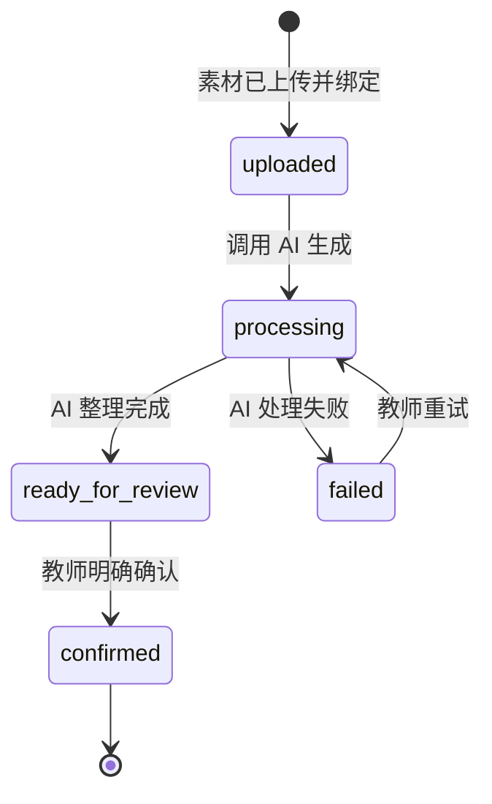

# 帮帮师记 MVP 用户流程

> 状态：流程定义稿  
> 更新日期：2026-08-22

## 1. 流程目标

让主班教师在带班现场用不超过 20 秒保存素材和必要情境，再在合适时间完成 AI 结果核对与专业分析。产品必须把“快速沉淀”和“教师确认”拆成两个时刻。

MVP 完成点：教师明确确认一条包含素材、客观白描、观察指标、分析与措施的观察记录。

## 2. 主流程总览

## 3. 两个使用时刻

### 3.1 时刻 A：现场快速沉淀

场景：教师正在组织活动或照看幼儿，注意力不能长时间停留在手机上。

目标：在 20 秒内把素材和最低限度的情境绑定起来，不要求教师现场写完整记录。

#### 步骤 A1：进入“今日素材”

- 默认进入当天素材列表。
- 主操作按钮为“添加素材”。
- 页面同时显示“处理中”和“待确认”的数量。

#### 步骤 A2：选择素材

- 从手机相册批量选择照片或视频。
- 首版沿用系统文件选择能力，不自建相机。
- 显示已选数量和单个素材预览。

异常处理：

- 格式不支持：指出具体文件和支持格式。
- 文件过大：保留其他可上传文件，不让整批失败。
- 上传中断：允许重试，不重复创建成功项。

#### 步骤 A3：补充必要情境

必填：

- 幼儿：MVP 默认单选；多人活动需求先记录，不在首版扩展数据结构。
- 游戏区域。

选填：

- 观察目的。
- 一句现场补充，例如幼儿原话、活动背景或持续时间。

交互要求：

- 优先选择，避免现场长文本输入。
- 记住最近使用的班级和区域。
- 不要求现场选择指标或填写分析。

#### 步骤 A4：保存并退出

- 点击“先存下来”。
- 上传成功后立即返回今日素材页。
- 状态显示为“处理中”，教师可以锁屏或离开页面。
- 页面明确提示“稍后回来确认，不会自动形成正式评价”。

### 3.2 时刻 B：稍后教师确认

场景：午休、下班前或集中整理时间，教师可以投入 2～3 分钟。

目标：核对 AI 输出，补充教师判断，形成可用于后续汇编的正式记录。

#### 步骤 B1：打开待确认记录

- 从“今日素材”的待确认入口进入。
- 首屏展示素材缩略图、幼儿、区域、拍摄时间和处理状态。
- AI 尚未完成时展示预计等待状态，允许先离开。

#### 步骤 B2：核对客观白描

- 展示 AI 生成的客观白描。
- 明确标注“AI 初稿，请核对事实”。
- 教师可以直接编辑。
- 系统保留 AI 原文与教师定稿，用于计算修改情况。

核对原则：

- 只保留可观察的动作、材料、语言、顺序和时长。
- 删除“认真、聪明、能力强、表现良好”等评价性表达。
- 不根据单段素材推测稳定性格、能力或情绪。

#### 步骤 B3：处理观察指标

指标分为两类展示：

1. 系统判定：由时长等确定性规则计算。
2. AI 建议：包含指标、层级、置信度和判断理由。

教师对每条 AI 建议必须选择：

- 采纳
- 否决

教师还可以手动补充 AI 未推荐的指标。未处理完候选项时不得直接确认正式记录，但可以保存草稿。

#### 步骤 B4：填写分析与措施

- “分析”和“措施”由教师填写。
- MVP 不让 AI 自动写入这两栏。
- 允许保存草稿后继续。
- 字段旁可提供简短写作提示，但提示不得变成自动评价。

#### 步骤 B5：教师确认

确认前检查：

- 客观白描不为空。
- 所有 AI 候选已经处理。
- 至少有一个被采纳或教师补充的指标；若没有，允许教师选择“本条不标指标”并填写原因，具体能力可在测试后决定是否开发。
- 分析和措施满足最小填写要求。

教师点击“确认记录”后：

- 状态从 `ready_for_review` 变为 `confirmed`。
- 记录进入观察记录库。
- 页面注明确认人和确认时间。
- AI 不得自动完成这一步。

## 4. 页面信息架构

### 4.1 今日素材页

主要内容：

- 添加素材按钮
- 今日素材列表
- 上传中、处理中、待确认、已完成状态
- 待确认数量

主要动作：添加素材、重试上传、进入待确认记录。

### 4.2 快速沉淀页

主要内容：

- 素材预览
- 幼儿选择
- 游戏区域选择
- 观察目的和现场补充

主要动作：先存下来。

### 4.3 AI 整理与教师确认页

按固定顺序展示：

1. 素材与情境
2. AI 客观白描
3. 系统判定
4. AI 候选指标
5. 教师分析
6. 教师措施

主要动作：编辑、采纳、否决、补充指标、保存草稿、确认记录。

### 4.4 观察记录详情页

主要内容：

- 幼儿、区域和观察时间
- 关联素材
- 客观白描
- 已确认指标
- 教师分析与措施
- 状态和确认时间

MVP 只提供查看，不在详情页加入期末汇编与导出。

## 5. 状态模型

后端使用五个状态：`uploaded`、`processing`、`ready_for_review`、`confirmed`、`failed`。合法流转只有 `uploaded → processing → ready_for_review → confirmed`、`processing → failed` 和 `failed → processing`（重试），状态只能由对应后端接口推进。

阶段时间戳只记录事实，不在业务代码中存储差值：`processing_started_at` 记录开始处理时间，`ready_at` 记录进入待确认时间，`confirmed_at` 记录教师确认时间，失败原因写入 `failure_reason`；`created_at` 为记录创建时间。`ready_at - created_at` 用于计算“素材到可用记录耗时”，目标不超过 3 分钟；`confirmed_at - ready_at` 用于计算教师确认耗时。

## 6. API 对应关系

| 用户动作 | 当前接口 |
|---|---|
| 查询幼儿和区域 | `GET /children`、`GET /areas` |
| 上传素材 | `POST /uploads` |
| 查看素材 | `GET /media` |
| 创建观察记录草稿 | `POST /observations` |
| 关联素材 | `POST /observations/{obs_id}/attach-media` |
| 生成客观白描 | `POST /observations/{obs_id}/narrative` |
| 推荐候选指标 | `POST /observations/{obs_id}/suggest-tags` |
| 查看候选指标 | `GET /observations/{obs_id}/tags` |
| 采纳或否决指标 | `PATCH /observations/{obs_id}/tags/{tag_id}` |
| 教师补充指标 | `POST /observations/{obs_id}/tags` |
| 编辑白描、分析与措施 | `PATCH /observations/{obs_id}` |
| 保存为正式记录 | `POST /observations/{obs_id}/confirm` |
| 查看记录详情 | `GET /observations/{obs_id}` |

## 7. 核心埋点

| 事件 | 关键字段 | 用途 |
|---|---|---|
| `capture_started` | 时间、入口 | 计算现场流程开始 |
| `media_upload_completed` | 数量、类型、耗时 | 判断上传体验 |
| `quick_capture_saved` | 幼儿、区域、总耗时 | 计算 20 秒目标 |
| `ai_processing_completed` | 引擎、是否 mock、耗时 | 监控处理过程 |
| `narrative_edited` | 原文字数、改后字数、差异量 | 评估白描可用性 |
| `tag_decided` | 指标、采纳结果、置信度、否决原因 | 评估候选质量 |
| `tag_teacher_added` | 指标、层级 | 观察 AI 漏检 |
| `draft_saved` | 所处步骤、累计耗时 | 识别流程中断点 |
| `observation_confirmed` | 总耗时、指标数 | 计算流程完成率 |

埋点不得记录真实幼儿姓名、原始照片内容或完整教师文本。

## 8. 第一轮可用性测试任务

给教师一组完全模拟的户外游戏素材，并提出任务：

> 你刚结束一次户外活动，现在还要继续带班。请把这组素材先保存下来；之后假设到了午休时间，请把它整理成一条可以留档的观察记录。

测试人员只在教师明确无法继续时提供帮助，并记录：

- 是否能找到添加素材入口。
- 是否理解为什么要选择幼儿和区域。
- 现场阶段是否出现不必要的长输入。
- 是否能区分系统判定和 AI 建议。
- 是否理解“采纳、否决、教师补充”。
- 是否知道分析和措施应由自己填写。
- 是否意识到只有教师确认后才成为正式记录。
- 每一步耗时、停顿、返回和放弃原因。

## 9. MVP 验收条件

1. 手机尺寸下可以完成全部主流程。
2. 快速沉淀阶段不要求填写长文本或处理指标。
3. AI mock 状态在页面上始终可见。
4. 系统判定与 AI 建议在视觉和文案上明确区分。
5. 所有 AI 候选都保留教师决定入口。
6. 教师可以修改白描并自行填写分析和措施。
7. 未经教师确认的记录不能显示为正式记录。
8. 上传或 AI 处理失败时有明确恢复路径。
9. 使用模拟数据完成至少一次端到端验证。
10. 3 名目标教师完成第一轮任务测试后，再决定扩展范围。
