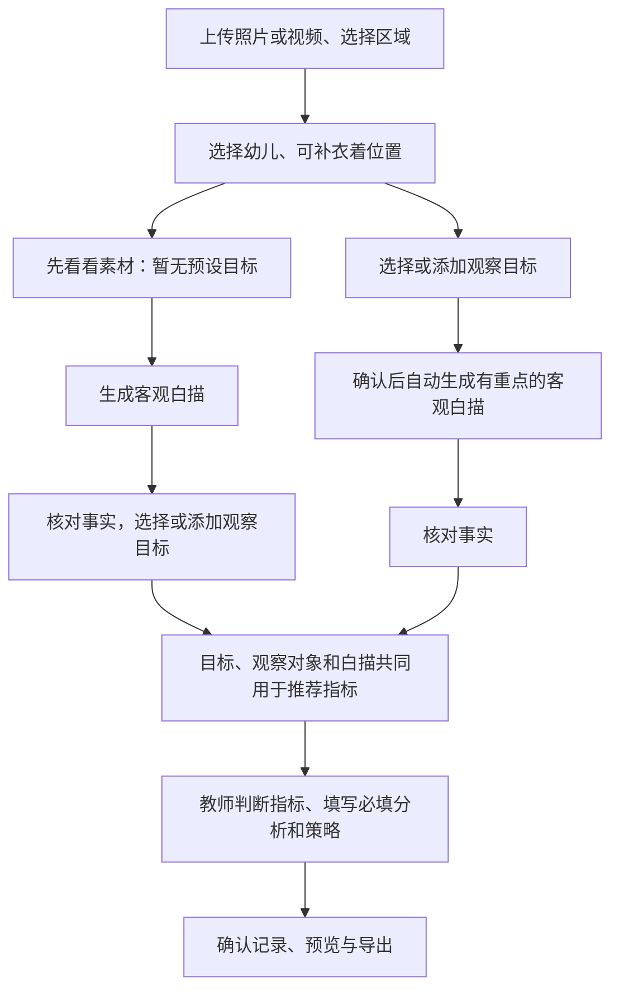
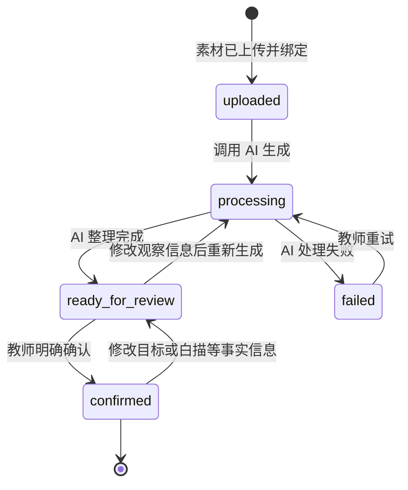

# 帮帮师记 MVP 用户流程

> 状态：流程定义稿  
> 更新日期：2026-09-06（已确认双入口：有目标 / 先看看素材）

## 1. 流程目标

支持主班教师先用手机拍摄照片或视频，回去后再上传，也保留现场上传的用法。上传素材和游戏区域后进入草稿，先选择幼儿。有目标时多选或添加目标，确认后自动生成白描；无预设目标时用次要入口“先看看素材”。核对白描后，必须确认目标才能推荐指标。教师判断与导出保持现有风格。

MVP 完成点：教师明确确认一条包含素材、客观白描、观察指标、分析与措施的观察记录。

## 2. 主流程总览

### 已确认的接口与交互约定

- 上传完成后进入准备步骤，不因 URL 标记或刷新自动调用 AI。
- 两条路径均允许先跳过幼儿姓名，在白描核对中按人物对应姓名；推荐指标前必须选定观察对象。；目标至少一个，建议 1～3 个但无上限。“添加观察目标”输入后直接选中，随记录保存；不擅自加入永久目标库。
- 白描接口显式区分 focused / explore。focused 必须有目标；explore 只记录事实，不生成或推断教师目的。
- 画面人物提示存入现有 note，发送模型前连同目标、白描中的已知姓名一起匿名化。数量不等于身份；不按出镜频率猜名单对应关系。
- 推理前必须保存并读取幼儿、目标、白描。目的不能充当白描证据。
- AI 审计记录保存输入摘要指纹。相同输入复用结果；输入改变生成新一轮，保留旧轮次和教师决定，但不混入当前展示、确认或导出。
- 有目标白描的对象、目标或人物提示改变后，先重新生成并核对；探索白描允许事后补目标，提供按目标重新查看素材的入口。
- 已确认记录若修改目标、白描或人物提示，自动回到草稿，重新核对推荐后确认；修改分析与策略时若清空任一必填项，回到草稿；两项仍完整时不改变确认状态。
- 未选项在对应区域提示；生成失败保留素材和输入，可重试；同一阶段底部一个主操作。保持现有绿色、米白底及圆角风格。

### 人物对应与指标选择（本轮修订）

- 人物姓名可在白描后选择：先按稳定人物代号或模型根据衣着、行为推测同一人物，把同一人的引用合并成一张卡。展示估计人数和原文线索，不声称已识别人脸或真实身份。
- 每张人物卡选一次姓名，“确认人物并代入”同时保存整篇替换与观察对象。群体称呼保持原样；归组有误可拆开核对，不能把全部人物套成主幼儿。
- 人物归组接口只接受自有记录，匿名化已知姓名，检查每个引用下标和重复分配，正文修改后拒绝应用过期分组。
- 指标卡只有“采用这个指标 / 不采用”两项主操作；采用后卡片内立即显示“已采用”，保存中显示“保存中”，失败回退并在卡内重试。底部始终显示已采用数量。
- 后半段分成“选择指标 → 填写分析和策略 → 确认并查看报告”。AI 分析建议收起，教师必填输入默认展开。

## 3. 两个使用时刻

### 3.1 时刻 A：现场快速沉淀

场景：教师正在组织活动或照看幼儿，注意力不能长时间停留在手机上。

目标：在 20 秒内把素材和最低限度的情境绑定起来，不要求教师现场写完整记录。

#### 步骤 A1：进入“今日素材”

- 默认进入当天素材列表。
- 主操作按钮为“添加素材”。
- 页面同时显示“处理中”和“待确认”的数量。

#### 步骤 A2：选择素材

- 从手机相册批量选择照片或视频。
- 首版沿用系统文件选择能力，不自建相机。
- 显示已选数量和单个素材预览。

异常处理：

- 格式不支持：指出具体文件和支持格式。
- 文件过大：保留其他可上传文件，不让整批失败。
- 上传中断：允许重试，不重复创建成功项。

#### 步骤 A3：补充必要情境

必填：

- 游戏区域。

选填：

- 一句现场补充，例如幼儿原话、活动背景或持续时间。

系统自动带入：

- 当前教师的班级。
- 班级对应的年龄段快照。

上传后先选择幼儿，再进入有目标或无预设目标路径。

交互要求：

- 优先选择，避免现场长文本输入。
- 记住最近使用的班级和区域。
- 不要求现场选择指标或填写分析。

#### 步骤 A4：上传并进入观察准备

- 点击“上传并继续”，上传成功后直接进入该条草稿。
- 先选择幼儿；主路径选择或添加观察目标后点击“确认并生成白描”。次要入口“先看看素材”不要求预设目标。
- 打开已有草稿或刷新不重复发起 AI；生成失败保留素材，提供手动重试。
- 自动化仅止于白描，不代替教师核对、采纳指标或确认记录；断网、锁屏或关闭页面后的持续执行不作保证。

### 3.2 时刻 B：稍后教师确认

场景：午休、下班前或集中整理时间，教师可以投入 2～3 分钟。

目标：核对 AI 输出，补充教师判断，形成可用于后续汇编的正式记录。

#### 步骤 B1：打开待确认记录

- 从“今日素材”的待确认入口进入。
- 首屏展示素材缩略图、幼儿、区域、拍摄时间和处理状态。
- 教师根据素材补充幼儿；已保存的班级和年龄段快照不随之改变。
- AI 尚未完成时展示预计等待状态，允许先离开。

#### 步骤 B2：核对客观白描

- 展示 AI 生成的客观白描。
- 明确标注“AI 初稿，请核对事实”。
- 教师可以直接编辑。
- 系统保留 AI 原文与教师定稿，用于计算修改情况。

核对原则：

- 只保留可观察的动作、材料、语言、顺序和时长。
- 删除“认真、聪明、能力强、表现良好”等评价性表达。
- 不根据单段素材推测稳定性格、能力或情绪。

#### 步骤 B3：处理观察指标

指标分为两类展示：

1. 系统判定：由时长等确定性规则计算。
2. AI 建议：包含指标、层级、置信度和判断理由。

教师对每条 AI 建议必须选择：

- 采纳
- 否决

教师可以手动补充 AI 未推荐的指标。最终报告只包含明确采纳的指标，未处理的建议不作为结论导出。

#### 步骤 B4：填写分析与措施

- “分析”和“措施”由教师填写。
- MVP 不让 AI 自动写入这两栏。
- 允许保存草稿后继续。
- 字段旁可提供简短写作提示，但提示不得变成自动评价。

#### 步骤 B5：教师确认

确认前检查：

- 客观白描不为空。
- 观察幼儿和至少一个观察目标已确认，白描与当前目标、观察对象一致。
- 至少有一个被采纳或教师补充的指标；若没有，允许教师选择“本条不标指标”并填写原因，具体能力可在测试后决定是否开发。
- 分析和策略均必填。先完成指标采用，再进入分析与策略，两项齐全才允许确认和导出。

教师点击“确认记录”后：

- 状态从 `ready_for_review` 变为 `confirmed`。
- 记录进入观察记录库。
- 页面注明确认人和确认时间。
- AI 不得自动完成这一步。

## 4. 页面信息架构

### 4.1 今日素材页

主要内容：

- 添加素材按钮
- 今日素材列表
- 上传中、处理中、待确认、已完成状态
- 待确认数量

主要动作：添加素材、重试上传、进入待确认记录。

### 4.2 快速沉淀页

主要内容：

- 素材预览
- 游戏区域选择
- 一句话现场补充

主要动作：先存下来。

### 4.3 AI 整理与教师确认页

按固定顺序展示：

1. 素材与情境
2. AI 客观白描
3. 系统判定
4. AI 候选指标
5. 教师分析
6. 教师措施

主要动作：编辑、采纳、否决、补充指标、保存草稿、确认记录。

### 4.4 观察记录详情页

主要内容：

- 幼儿、区域和观察时间
- 关联素材
- 客观白描
- 已确认指标
- 教师分析与措施
- 状态和确认时间

完整记录页提供 Word/PDF 导出，包含照片或视频代表帧。期末汇编不属于本轮。

## 5. 状态模型

后端使用五个状态：`uploaded`、`processing`、`ready_for_review`、`confirmed`、`failed`。主流程为 `uploaded → processing → ready_for_review → confirmed`；失败允许重试。观察信息改变后允许 `ready_for_review → processing` 重新生成；已确认记录修改事实信息回到 `ready_for_review`。状态只能由对应后端接口推进。

阶段时间戳只记录事实，不在业务代码中存储差值：`processing_started_at` 记录开始处理时间，`ready_at` 记录进入待确认时间，`confirmed_at` 记录教师确认时间，失败原因写入 `failure_reason`；`created_at` 为记录创建时间。`ready_at - created_at` 用于计算“素材到可用记录耗时”，目标不超过 3 分钟；`confirmed_at - ready_at` 用于计算教师确认耗时。

时间展示规则：后端继续以带时区标识的 UTC 保存时间戳；前端所有日期、时间及“今日”判断固定使用 `Asia/Shanghai`。观察记录表达的是深圳幼儿园当地发生时间，而不是查看者所在时区，因此不得改回跟随设备时区。

## 6. API 对应关系

| 用户动作 | 当前接口 |
|---|---|
| 查询幼儿和区域 | `GET /children`、`GET /areas` |
| 上传素材 | `POST /uploads` |
| 查看素材 | `GET /media` |
| 创建观察记录（仅 `area_id` 必填，可带 `child_id`、`note`） | `POST /observations` |
| 关联素材 | `POST /observations/{obs_id}/attach-media` |
| 生成客观白描 | `POST /observations/{obs_id}/narrative` |
| 推荐候选指标 | `POST /observations/{obs_id}/suggest-tags` |
| 查看候选指标 | `GET /observations/{obs_id}/tags` |
| 采纳或否决指标 | `PATCH /observations/{obs_id}/tags/{tag_id}` |
| 教师补充指标 | `POST /observations/{obs_id}/tags` |
| 补幼儿或现场说明，编辑四段正文 | `PATCH /observations/{obs_id}` |
| 保存为正式记录 | `POST /observations/{obs_id}/confirm` |
| 查看记录详情 | `GET /observations/{obs_id}` |

### 6.1 素材格式兼容待办

- HEIC/HEVC 素材在接入 AI 前需确认模型是否支持，不支持则需增加转码环节。
- 首页依赖浏览器原生能力预览 HEIC/HEIF；浏览器不支持时回退为图片占位图标，不影响素材上传和保存。
- 视频缩略图由后端在上传时生成，历史视频在首次读取缩略图时补生成；抽帧失败时接口返回原因，前端回退为视频占位图标。当前 macOS 开发环境使用系统 Quick Look，部署到非 macOS 环境前需替换为 ffmpeg 等服务端抽帧能力。

## 7. 核心埋点

| 事件 | 关键字段 | 用途 |
|---|---|---|
| `capture_started` | 时间、入口 | 计算现场流程开始 |
| `media_upload_completed` | 数量、类型、耗时 | 判断上传体验 |
| `quick_capture_saved` | 区域、总耗时 | 计算 20 秒目标 |
| `ai_processing_completed` | 引擎、是否 mock、耗时 | 监控处理过程 |
| `narrative_edited` | 原文字数、改后字数、差异量 | 评估白描可用性 |
| `tag_decided` | 指标、采纳结果、置信度、否决原因 | 评估候选质量 |
| `tag_teacher_added` | 指标、层级 | 观察 AI 漏检 |
| `draft_saved` | 所处步骤、累计耗时 | 识别流程中断点 |
| `observation_confirmed` | 总耗时、指标数 | 计算流程完成率 |

埋点不得记录真实幼儿姓名、原始照片内容或完整教师文本。

## 8. 第一轮可用性测试任务

给教师一组完全模拟的户外游戏素材，并提出任务：

> 你刚结束一次户外活动，现在还要继续带班。请把这组素材先保存下来；之后假设到了午休时间，请把它整理成一条可以留档的观察记录。

测试人员只在教师明确无法继续时提供帮助，并记录：

- 是否能找到添加素材入口。
- 是否理解为什么现场只选择区域、幼儿稍后补充。
- 现场阶段是否出现不必要的长输入。
- 是否能区分系统判定和 AI 建议。
- 是否理解“采纳、否决、教师补充”。
- 是否知道分析和措施应由自己填写。
- 是否意识到只有教师确认后才成为正式记录。
- 每一步耗时、停顿、返回和放弃原因。

## 9. MVP 验收条件

1. 手机尺寸下可以完成全部主流程。
2. 快速沉淀阶段不要求填写长文本或处理指标。
3. AI mock 状态在页面上始终可见。
4. 系统判定与 AI 建议在视觉和文案上明确区分。
5. 所有 AI 候选都保留教师决定入口。
6. 教师可以修改白描并自行填写分析和措施。
7. 未经教师确认的记录不能显示为正式记录。
8. 上传或 AI 处理失败时有明确恢复路径。
9. 使用模拟数据完成至少一次端到端验证。
10. 3 名目标教师完成第一轮任务测试后，再决定扩展范围。

历史已确认记录若缺少分析或策略，详情页显示补全入口，不能导出；保留原数据，补全后再保存。
